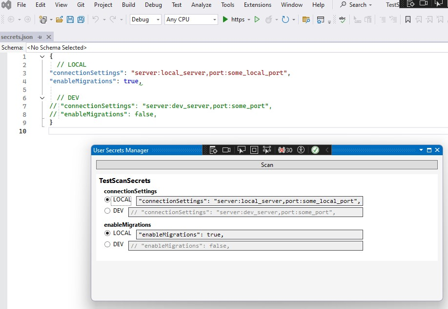
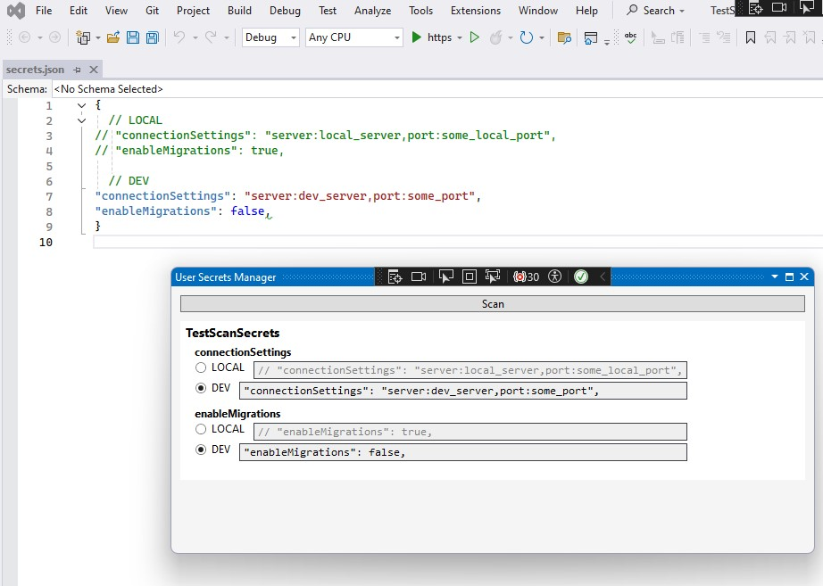

# User Secrets Manager extension

## Description and usage

I've made this extension for myself. At the moment it's pretty rough version, any help will be appreaciated.
Here's github page of the project:
[UserSecretsManager](https://github.com/kurskiev-t/UserSecretsManager)

> After installation, extension can be found in **Views -> Other Windows -> SecretsWindow**

It scans a solution for user secrets files for all projects, categorizes them by each section in those files. Groups those sections by the keys and allows to switch between active sections by chosing radio button options.

User Secrets file example:
```json
{
  // LOCAL
// "connectionSettings": "server:local_server,port:some_local_port",
// "enableMigrations": true,

  // DEV
"connectionSettings": "server:dev_server,port:some_port",
"enableMigrations": false,
}

```
Extension will make based on it two groups:

"connectionSettings" with two sections, 1 active, 1 inactive

"enableMigrations" with two sections, 1 active, 1 inactive

See screenshots below:





## Building from Source
1. Clone the repository: `git clone https://github.com/kurskiev-t/UserSecretsManager`
2. Open in Visual Studio 2019+.
3. Build in Release mode (`Ctrl+Shift+B`).
4. Install the `.vsix` from `bin/Release`.
